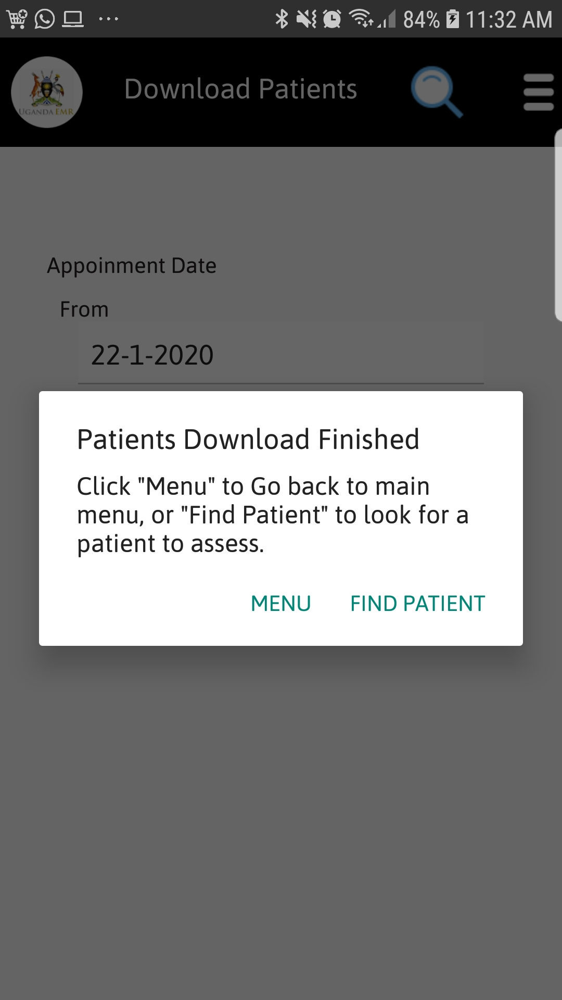
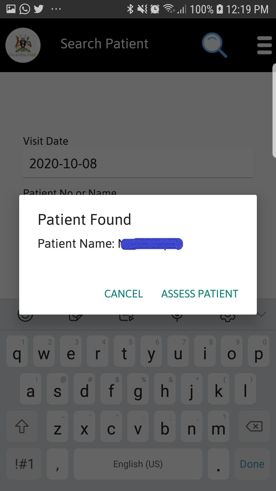
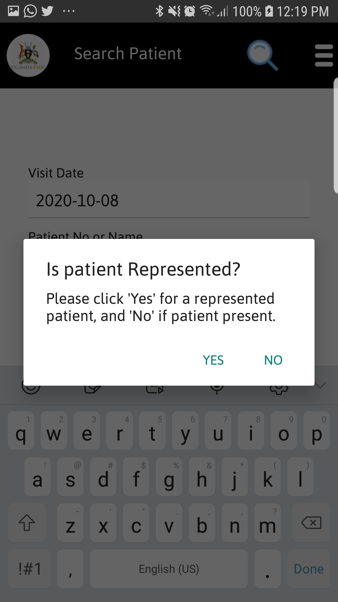

#### Downloading Patient In UgandaEMR Mobile
1. To Download Patients Tap on Download Patient on the menu screen. 
    Select Appointment Start and End Dates for patients with appointments to download, after Tap on the Download Patient Button as shown in the figure below. 

 
 2. After downloading patients a dialog will popup as shown in the figure below.
 
 
#### Find Patients In UgandaEMR Mobile
1. On the menu screen Tap on find patient a screen below will be seen.
  Enter appointment date, Patient Name or ART Number and Tap search button to assess the patient. 

if patient is found a screen below will be show to start assessing the patient.

2.To assess a patient tap on Assess patient button 

3.For represented patients Tap "Yes" and a screen to administer drug will be shown with the patient current Regimen