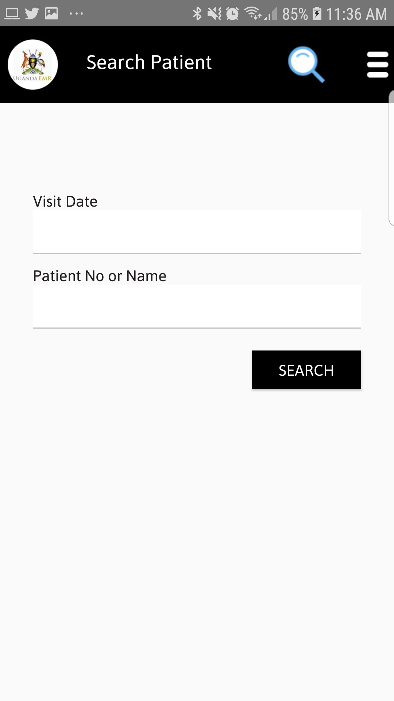

# Download Patients

## Downloading Patient In UgandaEMR Mobile

1. To Download Patients Tap Download Patient on the menu screen. Select Appointment Start and End Dates for patients with appointments to download, after Tap on the Download Patient Button as shown in the figure below. 
   1. After downloading patients a dialog will popup as shown in the figure below.

      

## Find Patients In UgandaEMR Mobile

1. On the menu screen Tap Find Patient, a screen below will be seen.

   Enter appointment date or vist date, Patient Name or ART Number and Tap search button to assess the patient. 

   

if patient is found a screen below will be show to start assessing the patient. 

1. To assess a patient tap on Assess patient button 
2. Follow the steps below to administer drugs for represented patients:
   * [Drug Administration Steps](drug-administration.md) 

