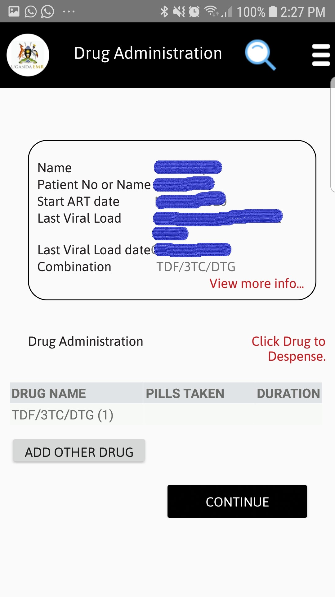
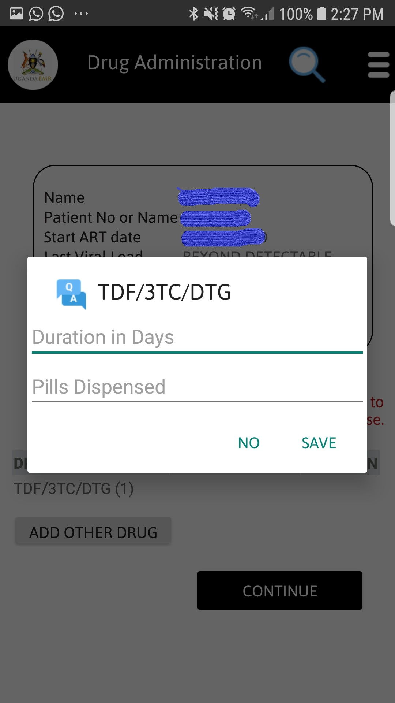
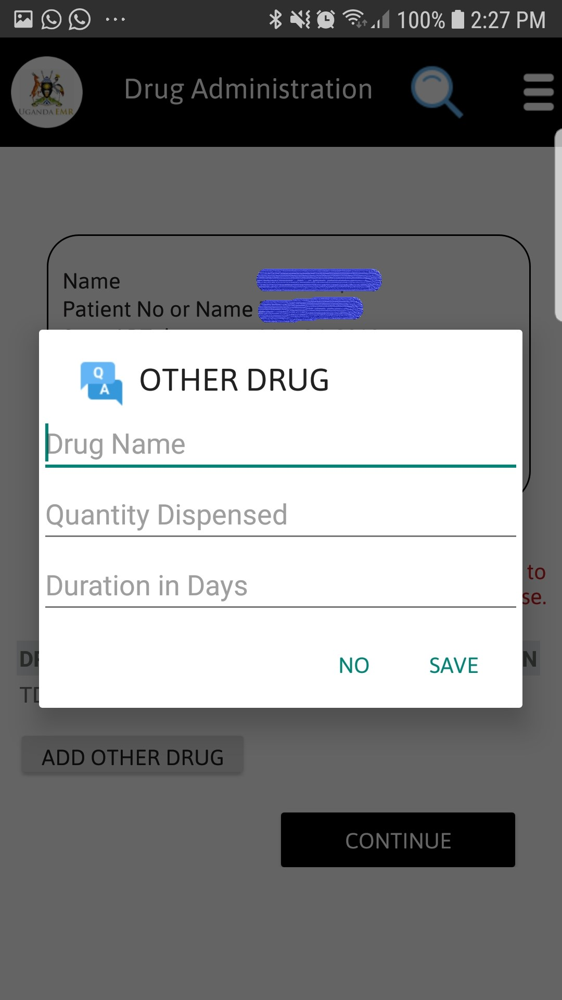

#### Drug Administration In UgandaEMR Mobile
1. The screen belows shows how to administer drug, each patients current Regimen is displayed as shown in the figure below.

Tap on the drug name from the table to administer drug, enter pills dispensed and duration in days then save as shown below.

incase of administering other drugs Tap on the add other drug and enter drug name, quantity dispensed and duration in days then save
