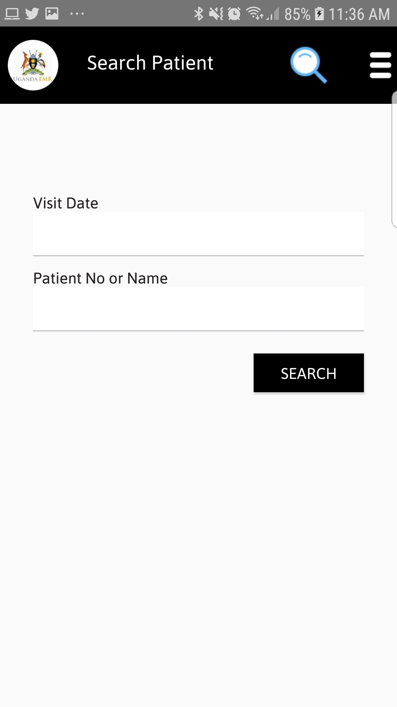

#### Find Patients In UgandaEMR Mobile
1. On the menu screen Tap Find Patient, a screen below will be seen.
  Enter appointment date or vist date, Patient Name or ART Number and Tap search button to assess the patient. 

if patient is found a screen below will be show to start assessing the patient.

2. To assess a patient tap on Assess patient button 

3. Follow the steps below to administer drugs for represented patients:
   * [Drug Administration Steps](drug-administration.md) 
