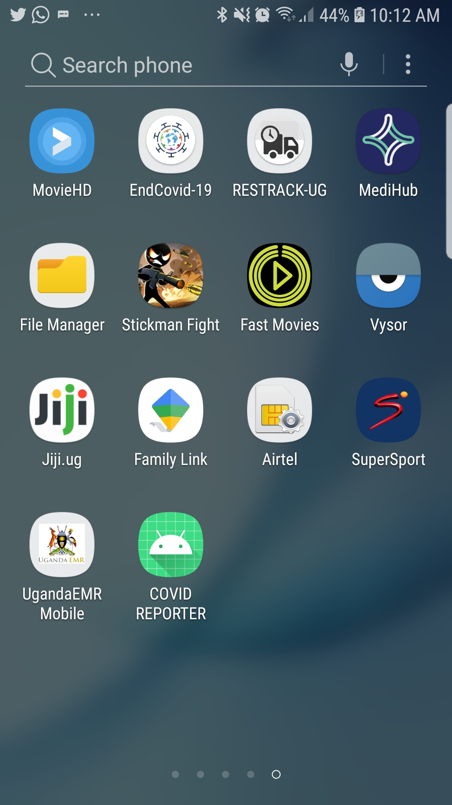
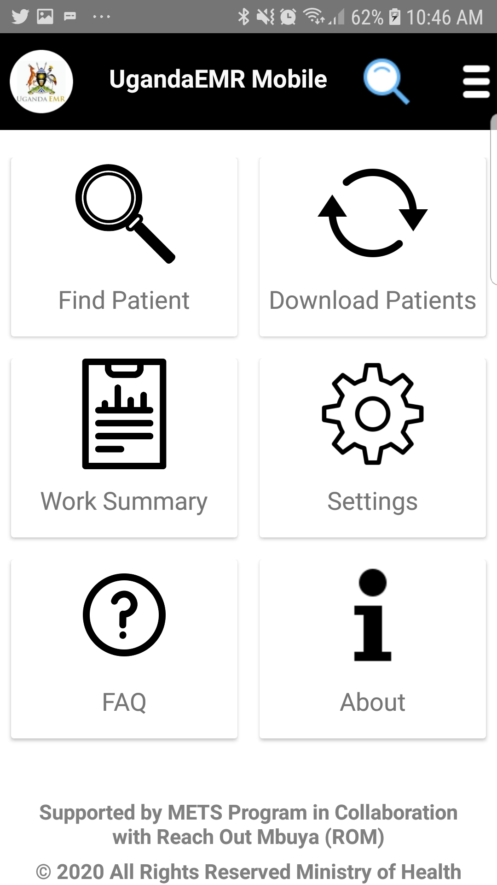

#### Logging In UgandaEMR Mobile
1. Launch UgandaEMR Mobile app on the Phone or Tablet. 
    Tap on the icon for UgandaEMR Mobile as shown in the figure below. 

2. Enter IP address, username and password to login
 

3. Click on login. This will navigate you to the home screen.
 
