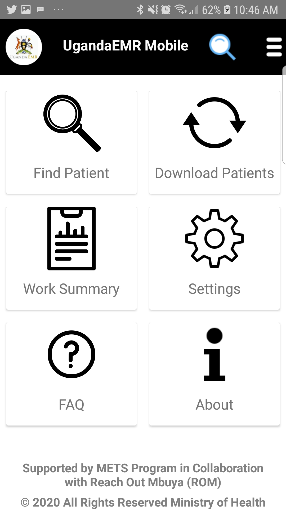

# Sync Data to UgandaEMR 

1. To sync data to UgandaEMR at facility level navigate through work summary from the main menu as shown in the figure below. 

A screen below will be shown  
a.) Select visit date for the data to be synced.
 
b.) Select "Full Assessment" option from the filter options.

2. A list of fully assessed patients will be shown, from here you can decide to sync all patients or select the patients to send by clicking on the checkbox.
To sync data Taping on Push Assessment button as shown in the figure  

